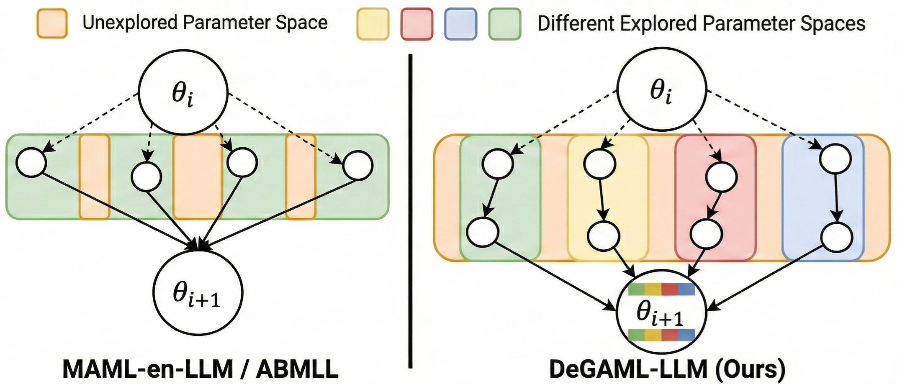
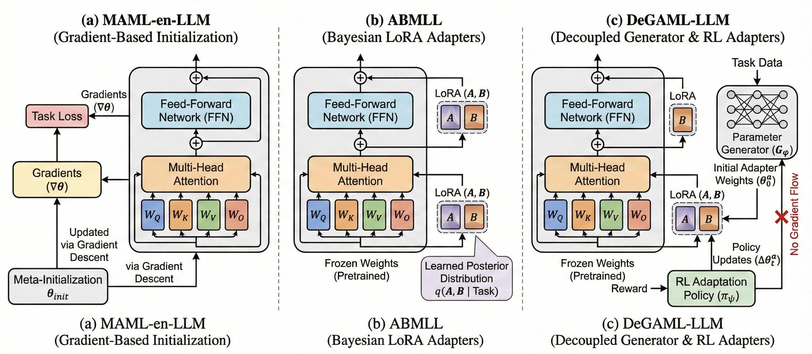

# DeGAML-LLM: Decoupled Generalization and Adaptation Meta-Learning for Large Language Models

<div align="center">



[](LICENSE)
[](https://www.python.org/downloads/)

</div>

## 📋 Overview

**DeGAML-LLM** introduces a novel meta-learning framework that explicitly decouples generalization and adaptation for large language models, addressing fundamental limitations in existing approaches like MAML-en-LLM and ABMLL.

### Key Innovation

Traditional meta-learning for LLMs couples two distinct objectives:
1. **Generalization**: Learning task-agnostic representations across task distributions
2. **Adaptation**: Enabling rapid task-specific refinement

DeGAML-LLM separates these through dedicated modules operating in distinct parameter spaces:

- **🔮 Generalization Module** ($\mathcal{G}_\phi$): Learns to generate LoRA adapter parameters from task prompts using a hyperconvolutional decoder trained on checkpoint trajectories
- **⚡ Adaptation Module** ($\pi_\psi$): Refines generated parameters via an RL policy that selects from four adaptation families (TTT, TTS, LoRA Mixing, Latent Space)

**Critical Design**: Gradients from adaptation *do not* flow back to the generalization module, ensuring true decoupling.

### Performance Highlights

✨ **State-of-the-art results** on common-sense reasoning, mathematics, logic, social, medical, and coding benchmarks  
🚀 **Outperforms** MAML-en-LLM, ABMLL, and standard multi-task baselines  
⚙️ **Flexible adaptation** via four distinct adaptation families with automatic strategy selection  
🎯 **Strong generalization** to out-of-domain tasks without task-specific fine-tuning

---

## 🏗️ Architecture

DeGAML-LLM consists of two key components trained sequentially:



### 1. Generalization Module (Parameter Generator)

- **Input**: Task prompts (unlabeled examples from test set)
- **Output**: Distribution over LoRA adapter parameters
- **Architecture**: 
  - Sentence-BERT encoder (all-MiniLM-L6-v2) for task embedding
  - Hyperconvolutional decoder for parameter generation
  - Parameter tokenization with 2D positional embeddings
- **Training**: Offline via MSE loss on collected LoRA checkpoints (no adaptation)

### 2. Adaptation Module (RL Policy)

- **Input**: Generated adapter parameters + validation performance
- **Output**: Adaptation strategy selection and refinement
- **Adaptation Families**:
  - **TTT (Test-Time Training)**: Fine-tune adapters on unlabeled test data via perplexity minimization
  - **TTS (Test-Time Scaling)**: Ensemble multiple adapters via max-confidence or majority vote
  - **LoRA Mixing**: Interpolate LoRA subspaces using two-subspace (TS) mixing
  - **Latent Space**: Optimize SLOT vectors (sample-specific latent parameters)
- **Training**: Online via ReST^EM with frozen generator (gradients detached)

---

## 🚀 Quick Start

### Installation

```bash
# Clone the repository
git clone https://github.com/YOUR_USERNAME/DeGAML-LLM.git
cd DeGAML-LLM

# Create environment and install dependencies
conda create -n degaml python=3.12
conda activate degaml
pip install -r requirements.txt
```

### Environment Setup

Configure paths via environment variables (optional):

```bash
export DEGAML_DATA_ROOT="./data"
export DEGAML_OUTPUT_ROOT="./outputs"  
export DEGAML_CHECKPOINT_ROOT="./checkpoints"
export DEGAML_MODEL_ROOT="./models"
```

### Download Models

```bash
# Download base LLM (Qwen2.5-0.5B or 1.5B)
huggingface-cli download Qwen/Qwen2.5-0.5B-Instruct --local-dir ./models/Qwen2.5-0.5B-Instruct

# Download Sentence-BERT encoder
huggingface-cli download sentence-transformers/all-MiniLM-L12-v2 --local-dir ./models/all-MiniLM-L12-v2
```

### Basic Usage

#### 1. Baseline Evaluation (No Adaptation)

Generate adapters directly from task prompts:

```bash
python -m degaml.core.baseline \
    --eval_dataset ARC-c \
    --test_dataset ARC-c \
    --num_samples 25
```

#### 2. Generate Hypotheses

Use the RL policy to propose adaptation strategies:

```bash
python -m degaml.core.hypothesis_generation \
    --model_name_or_path Qwen/Qwen2.5-0.5B-Instruct \
    --lora_adapter_path ./checkpoints/policy_adapter \
    --num_generations 20 \
    --output_file ./outputs/hypotheses.txt
```

#### 3. Run Adaptation

Execute adaptation strategies (example with TTT):

```bash
python -m degaml.adaptation.test_time_training \
    --eval_dataset ARC-c \
    --test_dataset ARC-c \
    --ttl_steps 5 \
    --learning_rate 1e-5 \
    --batch_size 4
```

For complete pipeline examples, see [docs/USAGE.md](docs/USAGE.md).

---

## 📊 Experimental Results

### In-Domain Tasks (Common-Sense Reasoning)

| Method | ARC-c | ARC-e | HellaSwag | BoolQ | PIQA | WinoGrande | Avg |
|--------|-------|-------|-----------|-------|------|------------|-----|
| No Meta-Train LoRA | 74.5 | 84.4 | 55.8 | 55.6 | 65.6 | 48.2 | 64.0 |
| Union Train LoRA | 63.2 | 73.9 | 48.9 | 55.1 | 47.8 | 61.3 | 58.3 |
| ABMLL | 69.9 | 83.2 | 51.1 | 63.2 | 54.3 | 52.9 | 62.4 |
| MAML-en-LLM | 66.0 | 84.3 | 59.3 | 58.7 | 68.1 | 56.8 | 65.5 |
| **DeGAML-LLM** | **73.7** | **88.4** | **57.2** | **58.8** | **70.7** | **57.3** | **67.7** |

### Out-of-Domain Tasks

| Method | GSM-8K | MATH | DivLogicEval | SocialIQA | CodeMMLU | JAMA | Avg |
|--------|--------|------|--------------|-----------|----------|------|-----|
| Union Train LoRA | 34.2 | 32.2 | 24.1 | 51.4 | 34.7 | 34.7 | 36.1 |
| ABMLL | 28.7 | 15.9 | 26.9 | 66.3 | 39.6 | 28.5 | 34.3 |
| MAML-en-LLM | 35.6 | 43.5 | 31.2 | 68.7 | 42.3 | 32.5 | 42.3 |
| **DeGAML-LLM** | **51.4** | **46.9** | **31.4** | **69.5** | **44.6** | **41.5** | **47.5** |

> **Note**: Results with Qwen2.5-1.5B-Instruct. See paper for complete results across model scales.

---

## 📚 Repository Structure

```
DeGAML-LLM/
├── degaml/                        # Main package
│   ├── core/                      # Core pipeline modules
│   │   ├── baseline.py            # Baseline adapter generation
│   │   ├── hypothesis_generation.py  # RL-based hypothesis generation
│   │   ├── accuracy.py            # Accuracy calculation
│   │   └── mega.py                # Pipeline orchestrator
│   ├── adaptation/                # Adaptation family modules
│   │   ├── test_time_training.py  # TTT implementation
│   │   ├── test_time_scaling.py   # TTS ensembling
│   │   ├── lora_mixing.py         # LoRA subspace mixing
│   │   └── latent_space.py        # SLOT vectors
│   ├── generator/                 # Parameter generator architecture
│   │   ├── dataset/              # Dataset handling
│   │   ├── model/                # Generator model
│   │   ├── module/               # Hyperconvolution modules
│   │   ├── tokenizer/            # Parameter tokenization
│   │   └── tools/                # Utilities
│   ├── policy/                    # RL policy training
│   ├── utils/                     # Shared utilities
│   │   ├── paths.py              # Path configuration
│   │   └── config.py             # Config management
│   └── ablation/                  # Ablation study scripts
├── configs/                       # Configuration files
├── docs/                          # Documentation
├── scripts/                       # Training/inference scripts
├── assets/                        # Paper figures
└── requirements.txt               # Dependencies
```

---

## 🔧 Advanced Usage

### Running Ablation Studies

Isolate contributions of individual adaptation families:

```bash
python -m degaml.ablation.ablation_runner \
    --eval_dataset ARC-c \
    --test_dataset MATH-MC \
    --family TTT \
    --num_samples 25 \
    --iterations 1
```

### Training the Parameter Generator

The parameter generator uses a hyperconvolutional decoder architecture that is self-contained in this repository. Key steps:

1. Collect LoRA checkpoints across meta-training tasks
2. Calculate importance scores for parameter tokenization
3. Train hyperconvolutional decoder via MSE loss

Training scripts and detailed instructions will be provided in future releases. Pre-trained checkpoints are available in [CHECKPOINTS.md](docs/CHECKPOINTS.md).

### Training the RL Policy

```bash
python -m degaml.policy.train_policy \
    --meta_train_tasks "ARC-c,HellaSwag,BoolQ" \
    --num_iterations 10 \
    --reward_type accuracy_improvement
```

---

## 📖 Documentation

- **[Installation Guide](docs/INSTALLATION.md)**: Detailed installation and setup instructions
- **[Usage Guide](docs/USAGE.md)**: Complete usage examples and tutorials
- **[Architecture](docs/ARCHITECTURE.md)**: In-depth architecture explanation
- **[Checkpoints](docs/CHECKPOINTS.md)**: Pre-trained model downloads

---

## 🎯 Citation

If you use DeGAML-LLM in your research, please cite our paper:

```bibtex
@inproceedings{degaml-llm2025,
  title={Decoupled Generalization and Adaptation Meta-Learning for Large Language Models},
  author={[Authors]},
  booktitle={[Conference]},
  year={2025}
}
```

---

## 🙏 Acknowledgments

- **Drag-and-Drop-LLMs** for the parameter generator architecture baseline
- **LLaMA-Factory** for training and inference infrastructure
- **vLLM** for efficient LLM inference
- **Sentence-Transformers** for text embedding models

---

## 📄 License

This project is licensed under the Apache License 2.0 - see the [LICENSE](LICENSE) file for details.

---

## 🤝 Contributing

We welcome contributions! Please see our contributing guidelines for more information.

## 📧 Contact

For questions and feedback, please open an issue or contact [contact email].

---

<div align="center">

**Star ⭐ this repository if you find it helpful!**

Made with ❤️ for advancing meta-learning in LLMs

</div>
